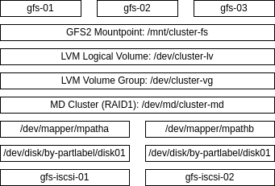

# GFS2 хранилище в VirtualBox

## Задание

1. Развернуть в **VirtualBox** конфигурацию для общего хранилища с **GFS2**.
2. Настроить базовую конфигурацию **GFS2** для совместного использования диска между виртуальными машинами.
3. Настроить **fencing**.

## Реализация

Задание сделано так, чтобы его можно было запустить как в **Vagrant**, так и в **Yandex Cloud**. После запуска происходит развёртывание следующих виртуальных машин:

- **gfs-iscsi-01** - первый сервер **iSCSI target**;
- **gfs-iscsi-02** - второй сервер **iSCSI target**;
- **gfs-01** - первый клиент файловой системы **GFS2**;
- **gfs-02** - второй клиент файловой системы **GFS2**;
- **gfs-03** - третий клиент файловой системы **GFS2**.

Реализована следующая схема отказоустойчивого общего хранилища:



1. На двух узлах (**gfs-iscsi-01** и **gfs-iscsi-02**) по **iSCSI** расшариваются общие диски на двух разных сетевых интерфейсах в сетях **gfs-iscsi01** и **gfs-iscsi02**.
2. Расшаренные диски подключаются с использованием обоюдной аутентификации на узлах **gfs-01**, **gfs-02**, **gfs-03**.
3. Поскольку диски расшариваются через два разных сетевых интерфейсах, то настраивается **multipath**. Также для каждого узла в `multipath.conf` настраивается **reservation_key** для последующей настройки агента **fence_mpath** в **pacemaker**.
4. Расшаренные узлах **gfs-01**, **gfs-02**, **gfs-03** объединяются в общий массив **RAID1** с использованием технолгии [MD Cluster](https://docs.kernel.org/driver-api/md/md-cluster.html).
5. Полученный массиве **/dev/md/cluster-md** добавляется в **LVM Shared Volume Group** с именем **cluster-vg** и на ней создаётся и активируется общий логический том **cluster-lv**.
6. Логический том **cluster-lv** форматируется в **GFS2** и монтируется на узлах **gfs-01**, **gfs-02**, **gfs-03**.

Для выполнения **fencing** (используется агент **fence_mpath**) и автоматического поднятия файловой системы после перезагрузки используется **pacemaker**. Обмен сообщениями между узлами кластера поддерживается с помощью **corosync** (настроена отказоустойчивая конфигурация с использованием трёх колец). В качестве распределённого менеджера блокировок используется **dlm**, который в свою очередь используется **MD Cluster**, **lvmlockd** и **gfs2** для блокировок доступа к ресурсам между узлами кластера.

В независимости от того, как созданы виртуальные машины, для их настройки запускается **Ansible Playbook** [provision.yml](provision.yml) который последовательно запускает следующие роли:

- **wait_connection** - ожидает доступность виртуальных машин.
- **apt_sources** - настраивает репозитории для пакетного менеджера **apt** (используется [mirror.yandex.ru](https://mirror.yandex.ru)).
- **chrony** - устанавливает **chrony** для синхронизации времени между узлами.
- **hosts** - прописывает адреса всех узлов в `/etc/hosts`.
- **gen_keys** - генерит `/etc/corosync/authkey` для кластера **corosync**.
- **disk_facts** - собирает информацию о дисках и их сигнатурах (с помощью утилит `lsblk` и `wipefs`).
- **disk_label** - разбивает диски и устанавливает на них **GPT Partition Label** для их дальнейшей идентификации.
- **target** - настраивает сервер **iSCSI Target**.
- **linux_modules** - устанавливает модули ядра (в **Yandex Cloud** стоит **linux-virtual**, который не содержит модулей ядра для работы с **GFS2**).
- **iscsi** - настраивает **iSCSI Initiator**.
- **mpath** - настраивает **multipathd**, в частности прописывает **reservation_key** в `/etc/multipath.conf` для последующего использования в агенте **fence_mpath** для настройки **fencing**'а.
- **corosync** - настраивает кластер **corosync** в несколько колец.
- **dlm** - устанавливает распределённый менеджер блокировок **dlm**.
- **mdadm** - устанавилвает **mdadm** и создаёт **RAID1** массив `/dev/md/cluster-md` (используется технология [MD Cluster](https://docs.kernel.org/driver-api/md/md-cluster.html)).
- **lvm_facts** - с помощью утилит **vgs** и **lvs** собирает информацию о группах и томах **lvm**;
- **lvm** - устанавливает **lvm2**, **lvm2-lockd**, создаёт группы томов, сами логические тома и активирует их.
- **gfs2** - устанавливает **gfs2-utils**.
- **filesystem** - форматирует общий диск в файловую систему **GFS2**.
- **directory** - создаёт пустую директорию `/mnt/cluster-fs`.
- **pacemaker** - устанавливает и настраивается **pacemaker**, который в свою очередь монтирует файловую систему `/dev/cluster-vg/cluster-lv` в `/mnt/cluster-fs`.

Данные роли настраиваются с помощью переменных, определённых в следующих файлах:

- [group_vars/all/ansible.yml](group_vars/all/ansible.yml) - общие переменные **ansible** для всех узлов;
- [group_vars/all/hosts.yml](group_vars/all/hosts.yml) - настройки для роли **hosts** (список узлов, которые нужно добавить в `/etc/hosts`);
- [group_vars/all/iscsi.yml](group_vars/all/iscsi.yml) - общие настройки для **iSCSI Target** и **iSCSI Initiator**;
- [group_vars/iscsi/iscsi.yml](group_vars/iscsi/iscsi.yml) - настройки **iSCSI Target**;
- [group_vars/gfs/iscsi.yml](group_vars/gfs/iscsi.yml) - настройки **iSCSI Initiator**;
- [group_vars/gfs/corosync.yml](group_vars/gfs/corosync.yml) - настройки **corosync**;
- [group_vars/gfs/gfs2.yml](group_vars/gfs/gfs2.yml) - настройки **MD Cluster**, **LVM**, **GFS2**;
- [host_vars/gfs-01/gfs2.yml](host_vars/gfs-01/gfs2.yml) - настройки создания **MD Cluster**, **LVM**, **GFS2**;
- [host_vars/gfs-01/pacemaker.yml](host_vars/gfs-01/pacemaker.yml) - настройки **pacemaker**.

## Запуск

### Запуск в Yandex Cloud

1. Необходимо установить и настроить утилиту **yc** по инструкции [Начало работы с интерфейсом командной строки](https://yandex.cloud/ru/docs/cli/quickstart).
2. Необходимо установить **Terraform** по инструкции [Начало работы с Terraform](https://yandex.cloud/ru/docs/tutorials/infrastructure-management/terraform-quickstart).
3. Необходимо установить **Ansible**.
4. Необходимо перейти в папку проекта и запустить скрипт [up.sh](up.sh).

### Запуск в Vagrant (VirtualBox)

Необходимо скачать **VagrantBox** для **bento/ubuntu-24.04** версии **202502.21.0** и добавить его в **Vagrant** под именем **bento/ubuntu-24.04/202502.21.0**. Сделать это можно командами:

```shell
curl -OL https://app.vagrantup.com/bento/boxes/ubuntu-24.04/versions/202502.21.0/providers/virtualbox/amd64/vagrant.box
vagrant box add vagrant.box --name "bento/ubuntu-24.04/202502.21.0"
rm vagrant.box
```

После этого нужно сделать **vagrant up** в папке проекта.

## Проверка

Протестировано в **OpenSUSE Tumbleweed**:

- **Vagrant 2.4.3**
- **VirtualBox 7.1.4_SUSE r165100**
- **Ansible 2.18.4**
- **Python 3.13.2**
- **Jinja2 3.1.6**

### Общая проверка работоспособности

Для проверки работоспособности запишем файл просмотрим список смонтированных файловых систем, после чего проверим запишем файл на первой и втором узле, а прочитаем с третьего:

```text
❯ vagrant ssh gfs-01 -c 'df -Tht gfs2'
Filesystem                          Type  Size  Used Avail Use% Mounted on
/dev/mapper/cluster--vg-cluster--lv gfs2   20G  100M   20G   1% /mnt/cluster-fs

❯ vagrant ssh gfs-02 -c 'df -Tht gfs2'
Filesystem                          Type  Size  Used Avail Use% Mounted on
/dev/mapper/cluster--vg-cluster--lv gfs2   20G  100M   20G   1% /mnt/cluster-fs

❯ vagrant ssh gfs-03 -c 'df -Tht gfs2'
Filesystem                          Type  Size  Used Avail Use% Mounted on
/dev/mapper/cluster--vg-cluster--lv gfs2   20G  100M   20G   1% /mnt/cluster-f

❯ vagrant ssh gfs-01 -c 'sudo dd if=/dev/zero of=/mnt/cluster-fs/file01 bs=1M count=100'
100+0 records in
100+0 records out
104857600 bytes (105 MB, 100 MiB) copied, 0.755457 s, 139 MB/s

❯ vagrant ssh gfs-02 -c 'sudo dd if=/dev/zero of=/mnt/cluster-fs/file02 bs=1M count=100'
100+0 records in
100+0 records out
104857600 bytes (105 MB, 100 MiB) copied, 0.565855 s, 185 MB/s

❯ vagrant ssh gfs-03 -c 'ls -la /mnt/cluster-fs'
total 205224
drwxr-xr-x 2 root root      3864 Mar 30 16:52 .
drwxr-xr-x 3 root root      4096 Mar 30 11:16 ..
-rw-r--r-- 1 root root 104857600 Mar 30 16:51 file01
-rw-r--r-- 1 root root 104857600 Mar 30 16:52 file02
```

### Проверка iSCSI Target

```text
❯ vagrant ssh gfs-iscsi-01 -c 'sudo targetcli ls'
o- / .............................................................................. [...]
  o- backstores ................................................................... [...]
  | o- block ....................................................... [Storage Objects: 1]
  | | o- disk01 .......... [/dev/disk/by-partlabel/disk01 (20.0GiB) write-thru activated]
  | |   o- alua ........................................................ [ALUA Groups: 1]
  | |     o- default_tg_pt_gp ............................ [ALUA state: Active/optimized]
  | o- fileio ...................................................... [Storage Objects: 0]
  | o- pscsi ....................................................... [Storage Objects: 0]
  | o- ramdisk ..................................................... [Storage Objects: 0]
  o- iscsi ............................................... [mutual disc auth, Targets: 1]
  | o- iqn.2025-03.ru.abegorov:gfs2:gfs-iscsi-01 .............................. [TPGs: 1]
  |   o- tpg1 ............................................... [no-gen-acls, auth per-acl]
  |     o- acls ............................................................... [ACLs: 3]
  |     | o- iqn.2025-03.ru.abegorov:gfs2:gfs-01 .......... [mutual auth, Mapped LUNs: 1]
  |     | | o- mapped_lun1 ..................................... [lun1 block/disk01 (rw)]
  |     | o- iqn.2025-03.ru.abegorov:gfs2:gfs-02 .......... [mutual auth, Mapped LUNs: 1]
  |     | | o- mapped_lun1 ..................................... [lun1 block/disk01 (rw)]
  |     | o- iqn.2025-03.ru.abegorov:gfs2:gfs-03 .......... [mutual auth, Mapped LUNs: 1]
  |     |   o- mapped_lun1 ..................................... [lun1 block/disk01 (rw)]
  |     o- luns ............................................................... [LUNs: 1]
  |     | o- lun1 ..... [block/disk01 (/dev/disk/by-partlabel/disk01) (default_tg_pt_gp)]
  |     o- portals ......................................................... [Portals: 2]
  |       o- 10.131.0.11:3260 ...................................................... [OK]
  |       o- 10.132.0.11:3260 ...................................................... [OK]
  o- loopback .............................................................. [Targets: 0]
  o- vhost ................................................................. [Targets: 0]

❯ vagrant ssh gfs-iscsi-02 -c 'sudo targetcli ls'
o- / .............................................................................. [...]
  o- backstores ................................................................... [...]
  | o- block ....................................................... [Storage Objects: 1]
  | | o- disk01 .......... [/dev/disk/by-partlabel/disk01 (20.0GiB) write-thru activated]
  | |   o- alua ........................................................ [ALUA Groups: 1]
  | |     o- default_tg_pt_gp ............................ [ALUA state: Active/optimized]
  | o- fileio ...................................................... [Storage Objects: 0]
  | o- pscsi ....................................................... [Storage Objects: 0]
  | o- ramdisk ..................................................... [Storage Objects: 0]
  o- iscsi ............................................... [mutual disc auth, Targets: 1]
  | o- iqn.2025-03.ru.abegorov:gfs2:gfs-iscsi-02 .............................. [TPGs: 1]
  |   o- tpg1 ............................................... [no-gen-acls, auth per-acl]
  |     o- acls ............................................................... [ACLs: 3]
  |     | o- iqn.2025-03.ru.abegorov:gfs2:gfs-01 .......... [mutual auth, Mapped LUNs: 1]
  |     | | o- mapped_lun1 ..................................... [lun1 block/disk01 (rw)]
  |     | o- iqn.2025-03.ru.abegorov:gfs2:gfs-02 .......... [mutual auth, Mapped LUNs: 1]
  |     | | o- mapped_lun1 ..................................... [lun1 block/disk01 (rw)]
  |     | o- iqn.2025-03.ru.abegorov:gfs2:gfs-03 .......... [mutual auth, Mapped LUNs: 1]
  |     |   o- mapped_lun1 ..................................... [lun1 block/disk01 (rw)]
  |     o- luns ............................................................... [LUNs: 1]
  |     | o- lun1 ..... [block/disk01 (/dev/disk/by-partlabel/disk01) (default_tg_pt_gp)]
  |     o- portals ......................................................... [Portals: 2]
  |       o- 10.131.0.12:3260 ...................................................... [OK]
  |       o- 10.132.0.12:3260 ...................................................... [OK]
  o- loopback .............................................................. [Targets: 0]
  o- vhost ................................................................. [Targets: 0]
```

### Проверка iSCSI Initiator

```text
❯ vagrant ssh gfs-01 -c 'sudo iscsiadm -m node'
10.131.0.11:3260,1 iqn.2025-03.ru.abegorov:gfs2:gfs-iscsi-01
10.132.0.11:3260,1 iqn.2025-03.ru.abegorov:gfs2:gfs-iscsi-01
10.131.0.12:3260,1 iqn.2025-03.ru.abegorov:gfs2:gfs-iscsi-02
10.132.0.12:3260,1 iqn.2025-03.ru.abegorov:gfs2:gfs-iscsi-02

❯ vagrant ssh gfs-01 -c 'sudo iscsiadm -m session -P3'
iSCSI Transport Class version 2.0-870
version 2.1.9
Target: iqn.2025-03.ru.abegorov:gfs2:gfs-iscsi-01 (non-flash)
        Current Portal: 10.131.0.11:3260,1
        Persistent Portal: 10.131.0.11:3260,1
                **********
                Interface:
                **********
                Iface Name: default
                Iface Transport: tcp
                Iface Initiatorname: iqn.2025-03.ru.abegorov:gfs2:gfs-01
                Iface IPaddress: 10.131.0.21
                Iface HWaddress: default
                Iface Netdev: default
                SID: 1
                iSCSI Connection State: LOGGED IN
                iSCSI Session State: LOGGED_IN
                Internal iscsid Session State: NO CHANGE
                *********
                Timeouts:
                *********
                Recovery Timeout: 5
                Target Reset Timeout: 30
                LUN Reset Timeout: 30
                Abort Timeout: 15
                *****
                CHAP:
                *****
                username: initiator
                password: ********
                username_in: initiator-mutual
                password_in: ********
                ************************
                Negotiated iSCSI params:
                ************************
                HeaderDigest: None
                DataDigest: None
                MaxRecvDataSegmentLength: 262144
                MaxXmitDataSegmentLength: 262144
                FirstBurstLength: 65536
                MaxBurstLength: 262144
                ImmediateData: Yes
                InitialR2T: Yes
                MaxOutstandingR2T: 1
                ************************
                Attached SCSI devices:
                ************************
                Host Number: 16 State: running
                scsi16 Channel 00 Id 0 Lun: 1
                        Attached scsi disk sdb          State: running
        Current Portal: 10.132.0.11:3260,1
        Persistent Portal: 10.132.0.11:3260,1
                **********
                Interface:
                **********
                Iface Name: default
                Iface Transport: tcp
                Iface Initiatorname: iqn.2025-03.ru.abegorov:gfs2:gfs-01
                Iface IPaddress: 10.132.0.21
                Iface HWaddress: default
                Iface Netdev: default
                SID: 2
                iSCSI Connection State: LOGGED IN
                iSCSI Session State: LOGGED_IN
                Internal iscsid Session State: NO CHANGE
                *********
                Timeouts:
                *********
                Recovery Timeout: 5
                Target Reset Timeout: 30
                LUN Reset Timeout: 30
                Abort Timeout: 15
                *****
                CHAP:
                *****
                username: initiator
                password: ********
                username_in: initiator-mutual
                password_in: ********
                ************************
                Negotiated iSCSI params:
                ************************
                HeaderDigest: None
                DataDigest: None
                MaxRecvDataSegmentLength: 262144
                MaxXmitDataSegmentLength: 262144
                FirstBurstLength: 65536
                MaxBurstLength: 262144
                ImmediateData: Yes
                InitialR2T: Yes
                MaxOutstandingR2T: 1
                ************************
                Attached SCSI devices:
                ************************
                Host Number: 17 State: running
                scsi17 Channel 00 Id 0 Lun: 1
                        Attached scsi disk sdc          State: running
Target: iqn.2025-03.ru.abegorov:gfs2:gfs-iscsi-02 (non-flash)
        Current Portal: 10.132.0.12:3260,1
        Persistent Portal: 10.132.0.12:3260,1
                **********
                Interface:
                **********
                Iface Name: default
                Iface Transport: tcp
                Iface Initiatorname: iqn.2025-03.ru.abegorov:gfs2:gfs-01
                Iface IPaddress: 10.132.0.21
                Iface HWaddress: default
                Iface Netdev: default
                SID: 3
                iSCSI Connection State: LOGGED IN
                iSCSI Session State: LOGGED_IN
                Internal iscsid Session State: NO CHANGE
                *********
                Timeouts:
                *********
                Recovery Timeout: 5
                Target Reset Timeout: 30
                LUN Reset Timeout: 30
                Abort Timeout: 15
                *****
                CHAP:
                *****
                username: initiator
                password: ********
                username_in: initiator-mutual
                password_in: ********
                ************************
                Negotiated iSCSI params:
                ************************
                HeaderDigest: None
                DataDigest: None
                MaxRecvDataSegmentLength: 262144
                MaxXmitDataSegmentLength: 262144
                FirstBurstLength: 65536
                MaxBurstLength: 262144
                ImmediateData: Yes
                InitialR2T: Yes
                MaxOutstandingR2T: 1
                ************************
                Attached SCSI devices:
                ************************
                Host Number: 18 State: running
                scsi18 Channel 00 Id 0 Lun: 1
                        Attached scsi disk sdd          State: running
        Current Portal: 10.131.0.12:3260,1
        Persistent Portal: 10.131.0.12:3260,1
                **********
                Interface:
                **********
                Iface Name: default
                Iface Transport: tcp
                Iface Initiatorname: iqn.2025-03.ru.abegorov:gfs2:gfs-01
                Iface IPaddress: 10.131.0.21
                Iface HWaddress: default
                Iface Netdev: default
                SID: 4
                iSCSI Connection State: LOGGED IN
                iSCSI Session State: LOGGED_IN
                Internal iscsid Session State: NO CHANGE
                *********
                Timeouts:
                *********
                Recovery Timeout: 5
                Target Reset Timeout: 30
                LUN Reset Timeout: 30
                Abort Timeout: 15
                *****
                CHAP:
                *****
                username: initiator
                password: ********
                username_in: initiator-mutual
                password_in: ********
                ************************
                Negotiated iSCSI params:
                ************************
                HeaderDigest: None
                DataDigest: None
                MaxRecvDataSegmentLength: 262144
                MaxXmitDataSegmentLength: 262144
                FirstBurstLength: 65536
                MaxBurstLength: 262144
                ImmediateData: Yes
                InitialR2T: Yes
                MaxOutstandingR2T: 1
                ************************
                Attached SCSI devices:
                ************************
                Host Number: 19 State: running
                scsi19 Channel 00 Id 0 Lun: 1
                        Attached scsi disk sde          State: running
```

### Проверка Multipath

```text
❯ vagrant ssh gfs-01 -c 'sudo multipath -ll'
mpatha (36001405d618a8d33eae5caeba25c278c) dm-1 LIO-ORG,disk01
size=20G features='1 queue_if_no_path' hwhandler='1 alua' wp=rw
`-+- policy='round-robin 0' prio=50 status=active
  |- 16:0:0:1 sdb 8:16 active ready running
  `- 17:0:0:1 sdc 8:32 active ready running
mpathb (3600140572748e8b2b685433811e716ed) dm-2 LIO-ORG,disk01
size=20G features='1 queue_if_no_path' hwhandler='1 alua' wp=rw
`-+- policy='round-robin 0' prio=50 status=active
  |- 18:0:0:1 sdd 8:48 active ready running
  `- 19:0:0:1 sde 8:64 active ready running
```

### Провека lsblk

```text
❯ vagrant ssh gfs-01 -c 'lsblk'
NAME                          MAJ:MIN RM  SIZE RO TYPE  MOUNTPOINTS
sda                             8:0    0   64G  0 disk
├─sda1                          8:1    0    1M  0 part
├─sda2                          8:2    0    2G  0 part  /boot
└─sda3                          8:3    0   62G  0 part
  └─ubuntu--vg-ubuntu--lv     252:0    0   31G  0 lvm   /
sdb                             8:16   0   20G  0 disk
└─mpatha                      252:1    0   20G  0 mpath
  └─md127                       9:127  0   20G  0 raid1
    └─cluster--vg-cluster--lv 252:3    0 19.9G  0 lvm   /mnt/cluster-fs
sdc                             8:32   0   20G  0 disk
└─mpatha                      252:1    0   20G  0 mpath
  └─md127                       9:127  0   20G  0 raid1
    └─cluster--vg-cluster--lv 252:3    0 19.9G  0 lvm   /mnt/cluster-fs
sdd                             8:48   0   20G  0 disk
└─mpathb                      252:2    0   20G  0 mpath
  └─md127                       9:127  0   20G  0 raid1
    └─cluster--vg-cluster--lv 252:3    0 19.9G  0 lvm   /mnt/cluster-fs
sde                             8:64   0   20G  0 disk
└─mpathb                      252:2    0   20G  0 mpath
  └─md127                       9:127  0   20G  0 raid1
    └─cluster--vg-cluster--lv 252:3    0 19.9G  0 lvm   /mnt/cluster-fs
```

### Проверка Corosync

```text
❯ vagrant ssh gfs-01 -c 'sudo corosync-cfgtool -s'
Local node ID 1, transport knet
LINK ID 0 udp
        addr    = 192.168.56.21
        status:
                nodeid:          1:     localhost
                nodeid:          2:     connected
                nodeid:          3:     connected
LINK ID 1 udp
        addr    = 10.131.0.21
        status:
                nodeid:          1:     localhost
                nodeid:          2:     connected
                nodeid:          3:     connected
LINK ID 2 udp
        addr    = 10.132.0.21
        status:
                nodeid:          1:     localhost
                nodeid:          2:     connected
                nodeid:          3:     connected

❯ vagrant ssh gfs-01 -c 'sudo corosync-cmapctl'
internal_configuration.service.0.name (str) = corosync_cmap
internal_configuration.service.0.ver (u32) = 0
internal_configuration.service.1.name (str) = corosync_cfg
internal_configuration.service.1.ver (u32) = 0
internal_configuration.service.2.name (str) = corosync_cpg
internal_configuration.service.2.ver (u32) = 0
internal_configuration.service.3.name (str) = corosync_quorum
internal_configuration.service.3.ver (u32) = 0
internal_configuration.service.4.name (str) = corosync_pload
internal_configuration.service.4.ver (u32) = 0
internal_configuration.service.5.name (str) = corosync_votequorum
internal_configuration.service.5.ver (u32) = 0
internal_configuration.service.6.name (str) = corosync_mon
internal_configuration.service.6.ver (u32) = 0
internal_configuration.service.7.name (str) = corosync_wd
internal_configuration.service.7.ver (u32) = 0
logging.logfile (str) = /var/log/corosync/corosync.log
logging.timestamp (str) = on
logging.to_logfile (str) = yes
logging.to_syslog (str) = yes
nodelist.local_node_pos (u32) = 0
nodelist.node.0.name (str) = gfs-01
nodelist.node.0.nodeid (u32) = 1
nodelist.node.0.ring0_addr (str) = 192.168.56.21
nodelist.node.0.ring1_addr (str) = 10.131.0.21
nodelist.node.0.ring2_addr (str) = 10.132.0.21
nodelist.node.1.name (str) = gfs-02
nodelist.node.1.nodeid (u32) = 2
nodelist.node.1.ring0_addr (str) = 192.168.56.22
nodelist.node.1.ring1_addr (str) = 10.131.0.22
nodelist.node.1.ring2_addr (str) = 10.132.0.22
nodelist.node.2.name (str) = gfs-03
nodelist.node.2.nodeid (u32) = 3
nodelist.node.2.ring0_addr (str) = 192.168.56.23
nodelist.node.2.ring1_addr (str) = 10.131.0.23
nodelist.node.2.ring2_addr (str) = 10.132.0.23
quorum.provider (str) = corosync_votequorum
resources.system.load_15min.current (dbl) = 0.000000
resources.system.load_15min.last_updated (u64) = 0
resources.system.load_15min.poll_period (u64) = 3000
resources.system.load_15min.state (str) = stopped
resources.system.memory_used.current (i32) = 0
resources.system.memory_used.last_updated (u64) = 0
resources.system.memory_used.poll_period (u64) = 3000
resources.system.memory_used.state (str) = stopped
resources.watchdog_timeout (u32) = 6
runtime.blackbox.dump_flight_data (str) = no
runtime.blackbox.dump_state (str) = no
runtime.config.totem.block_unlisted_ips (u32) = 1
runtime.config.totem.cancel_token_hold_on_retransmit (u32) = 0
runtime.config.totem.consensus (u32) = 4380
runtime.config.totem.downcheck (u32) = 1000
runtime.config.totem.fail_recv_const (u32) = 2500
runtime.config.totem.heartbeat_failures_allowed (u32) = 0
runtime.config.totem.hold (u32) = 685
runtime.config.totem.interface.0.knet_ping_interval (u32) = 912
runtime.config.totem.interface.0.knet_ping_timeout (u32) = 1825
runtime.config.totem.interface.1.knet_ping_interval (u32) = 912
runtime.config.totem.interface.1.knet_ping_timeout (u32) = 1825
runtime.config.totem.interface.2.knet_ping_interval (u32) = 912
runtime.config.totem.interface.2.knet_ping_timeout (u32) = 1825
runtime.config.totem.join (u32) = 50
runtime.config.totem.knet_compression_level (i32) = 0
runtime.config.totem.knet_compression_model (str) = none
runtime.config.totem.knet_compression_threshold (u32) = 0
runtime.config.totem.knet_mtu (u32) = 0
runtime.config.totem.knet_pmtud_interval (u32) = 30
runtime.config.totem.max_messages (u32) = 17
runtime.config.totem.max_network_delay (u32) = 50
runtime.config.totem.merge (u32) = 200
runtime.config.totem.miss_count_const (u32) = 5
runtime.config.totem.send_join (u32) = 0
runtime.config.totem.seqno_unchanged_const (u32) = 30
runtime.config.totem.token (u32) = 3650
runtime.config.totem.token_retransmit (u32) = 869
runtime.config.totem.token_retransmits_before_loss_const (u32) = 4
runtime.config.totem.token_warning (u32) = 75
runtime.config.totem.window_size (u32) = 50
runtime.force_gather (str) = no
runtime.members.1.config_version (u64) = 0
runtime.members.1.ip (str) = r(0) ip(192.168.56.21) r(1) ip(10.131.0.21) r(2) ip(10.132.0.21)
runtime.members.1.join_count (u32) = 1
runtime.members.1.status (str) = joined
runtime.members.2.config_version (u64) = 0
runtime.members.2.ip (str) = r(0) ip(192.168.56.22) r(1) ip(10.131.0.22) r(2) ip(10.132.0.22)
runtime.members.2.join_count (u32) = 1
runtime.members.2.status (str) = joined
runtime.members.3.config_version (u64) = 0
runtime.members.3.ip (str) = r(0) ip(192.168.56.23) r(1) ip(10.131.0.23) r(2) ip(10.132.0.23)
runtime.members.3.join_count (u32) = 1
runtime.members.3.status (str) = joined
runtime.services.cfg.0.rx (u64) = 0
runtime.services.cfg.0.tx (u64) = 0
runtime.services.cfg.1.rx (u64) = 0
runtime.services.cfg.1.tx (u64) = 0
runtime.services.cfg.2.rx (u64) = 0
runtime.services.cfg.2.tx (u64) = 0
runtime.services.cfg.3.rx (u64) = 0
runtime.services.cfg.3.tx (u64) = 0
runtime.services.cfg.4.rx (u64) = 0
runtime.services.cfg.4.tx (u64) = 0
runtime.services.cfg.service_id (u16) = 1
runtime.services.cmap.0.rx (u64) = 6
runtime.services.cmap.0.tx (u64) = 3
runtime.services.cmap.service_id (u16) = 0
runtime.services.cpg.0.rx (u64) = 28
runtime.services.cpg.0.tx (u64) = 10
runtime.services.cpg.1.rx (u64) = 1
runtime.services.cpg.1.tx (u64) = 1
runtime.services.cpg.2.rx (u64) = 0
runtime.services.cpg.2.tx (u64) = 0
runtime.services.cpg.3.rx (u64) = 359
runtime.services.cpg.3.tx (u64) = 98
runtime.services.cpg.4.rx (u64) = 0
runtime.services.cpg.4.tx (u64) = 0
runtime.services.cpg.5.rx (u64) = 6
runtime.services.cpg.5.tx (u64) = 3
runtime.services.cpg.6.rx (u64) = 0
runtime.services.cpg.6.tx (u64) = 0
runtime.services.cpg.service_id (u16) = 2
runtime.services.mon.service_id (u16) = 6
runtime.services.pload.0.rx (u64) = 0
runtime.services.pload.0.tx (u64) = 0
runtime.services.pload.1.rx (u64) = 0
runtime.services.pload.1.tx (u64) = 0
runtime.services.pload.service_id (u16) = 4
runtime.services.quorum.service_id (u16) = 3
runtime.services.votequorum.0.rx (u64) = 13
runtime.services.votequorum.0.tx (u64) = 6
runtime.services.votequorum.1.rx (u64) = 0
runtime.services.votequorum.1.tx (u64) = 0
runtime.services.votequorum.2.rx (u64) = 0
runtime.services.votequorum.2.tx (u64) = 0
runtime.services.votequorum.3.rx (u64) = 0
runtime.services.votequorum.3.tx (u64) = 0
runtime.services.votequorum.service_id (u16) = 5
runtime.services.wd.service_id (u16) = 7
runtime.votequorum.ev_barrier (u32) = 3
runtime.votequorum.highest_node_id (u32) = 3
runtime.votequorum.lowest_node_id (u32) = 1
runtime.votequorum.this_node_id (u32) = 1
runtime.votequorum.two_node (u8) = 0
totem.cluster_name (str) = gfs2
totem.cluster_uuid (str) = 79e506a6de50c0008635bb2040f9fcb7
totem.crypto_cipher (str) = aes256
totem.crypto_hash (str) = sha256
totem.interface.0.bindnetaddr (str) = 192.168.56.21
totem.interface.1.bindnetaddr (str) = 10.131.0.21
totem.interface.2.bindnetaddr (str) = 10.132.0.21
totem.rrp_mode (str) = passive
totem.transport (str) = knet
totem.version (u32) = 2
uidgid.gid.111 (u8) = 1
```

### Проверка DLM

```text
❯ vagrant ssh gfs-01 -c 'sudo dlm_tool -n ls'
dlm lockspaces
name          gfs2
id            0xe4f48a18
flags         0x00000000
change        member 3 joined 1 remove 0 failed 0 seq 1,1
members       1 2 3
all nodes
nodeid 1 member 1 failed 0 start 1 seq_add 1 seq_rem 0 check none
nodeid 2 member 1 failed 0 start 1 seq_add 1 seq_rem 0 check none
nodeid 3 member 1 failed 0 start 1 seq_add 1 seq_rem 0 check none

name          lvm_cluster-vg
id            0x998ea520
flags         0x00000000
change        member 3 joined 1 remove 0 failed 0 seq 3,3
members       1 2 3
all nodes
nodeid 1 member 1 failed 0 start 1 seq_add 1 seq_rem 0 check none
nodeid 2 member 1 failed 0 start 1 seq_add 2 seq_rem 0 check none
nodeid 3 member 1 failed 0 start 1 seq_add 3 seq_rem 0 check none

name          lvm_global
id            0x12aabd2d
flags         0x00000000
change        member 3 joined 1 remove 0 failed 0 seq 1,1
members       1 2 3
all nodes
nodeid 1 member 1 failed 0 start 1 seq_add 1 seq_rem 0 check none
nodeid 2 member 1 failed 0 start 1 seq_add 1 seq_rem 0 check none
nodeid 3 member 1 failed 0 start 1 seq_add 1 seq_rem 0 check none

name          b2f32024-ad8c-599e-892d-703ef58f3257
id            0xb92325c0
flags         0x00000000
change        member 3 joined 1 remove 0 failed 0 seq 3,3
members       1 2 3
all nodes
nodeid 1 member 1 failed 0 start 1 seq_add 1 seq_rem 0 check none
nodeid 2 member 1 failed 0 start 1 seq_add 2 seq_rem 0 check none
nodeid 3 member 1 failed 0 start 1 seq_add 3 seq_rem 0 check none
```

### Проверка Pacemaker

```text
❯ vagrant ssh gfs-01 -c 'sudo pacemakerd --features'
Pacemaker 2.1.6 (Build: 6fdc9deea29)
 Supporting v3.17.4: agent-manpages ascii-docs books cibsecrets corosync-ge-2 generated-manpages lha monotonic nagios ncurses remote systemd

❯ vagrant ssh gfs-01 -c 'sudo pcs cluster status'
Cluster Status:
 Cluster Summary:
   * Stack: corosync (Pacemaker is running)
   * Current DC: gfs-02 (version 2.1.6-6fdc9deea29) - partition with quorum
   * Last updated: Sun Mar 30 16:29:39 2025 on gfs-01
   * Last change:  Sun Mar 30 11:21:29 2025 by root via cibadmin on gfs-01
   * 3 nodes configured
   * 16 resource instances configured
 Node List:
   * Online: [ gfs-01 gfs-02 gfs-03 ]

PCSD Status:
Warning: Unable to read the known-hosts file: No such file or directory: '/var/lib/pcsd/known-hosts'
  gfs-01: Offline
  gfs-02: Offline
  gfs-03: Offline

❯ vagrant ssh gfs-01 -c 'sudo pcs status'
Cluster name: gfs2
Cluster Summary:
  * Stack: corosync (Pacemaker is running)
  * Current DC: gfs-02 (version 2.1.6-6fdc9deea29) - partition with quorum
  * Last updated: Sun Mar 30 16:30:20 2025 on gfs-01
  * Last change:  Sun Mar 30 11:21:29 2025 by root via cibadmin on gfs-01
  * 3 nodes configured
  * 16 resource instances configured

Node List:
  * Online: [ gfs-01 gfs-02 gfs-03 ]

Full List of Resources:
  * mpath-fencing       (stonith:fence_mpath):   Started gfs-01
  * Clone Set: dlm-clone [dlm]:
    * Started: [ gfs-01 gfs-02 gfs-03 ]
  * Clone Set: lvmlockd-clone [lvmlockd]:
    * Started: [ gfs-01 gfs-02 gfs-03 ]
  * Clone Set: cluster-md-clone [cluster-md]:
    * Started: [ gfs-01 gfs-02 gfs-03 ]
  * Clone Set: cluster-lv-clone [cluster-lv]:
    * Started: [ gfs-01 gfs-02 gfs-03 ]
  * Clone Set: cluster-fs-clone [cluster-fs]:
    * Started: [ gfs-01 gfs-02 gfs-03 ]

Daemon Status:
  corosync: active/enabled
  pacemaker: active/enabled
  pcsd: inactive/disabled
```

### Проверка настроек fencing

```text
❯ vagrant ssh gfs-01 -c 'sudo pcs stonith config'
Resource: mpath-fencing (class=stonith type=fence_mpath)
  Attributes: mpath-fencing-instance_attributes
    devices=/dev/mapper/mpatha,/dev/mapper/mpathb
    pcmk_host_argument=key
    pcmk_host_map=gfs-01:f4cac3424bcbc846;gfs-02:b391cf047d190220;gfs-03:a124746b316ae011
    pcmk_monitor_action=metadata
    pcmk_reboot_action=off
  Meta Attributes: mpath-fencing-meta_attributes
    provides=unfencing
  Operations:
    monitor: mpath-fencing-monitor-interval-1s
      interval=1s
```

### Проверка MD Cluster

```text
❯ vagrant ssh gfs-01 -c 'sudo mdadm --detail /dev/md/cluster-md'
/dev/md/cluster-md:
           Version : 1.2
     Creation Time : Sun Mar 30 11:16:05 2025
        Raid Level : raid1
        Array Size : 20952064 (19.98 GiB 21.45 GB)
     Used Dev Size : 20952064 (19.98 GiB 21.45 GB)
      Raid Devices : 2
     Total Devices : 2
       Persistence : Superblock is persistent

     Intent Bitmap : Internal(Clustered)

       Update Time : Sun Mar 30 11:21:21 2025
             State : clean
    Active Devices : 2
   Working Devices : 2
    Failed Devices : 0
     Spare Devices : 0

Consistency Policy : bitmap

              Name : gfs-01:cluster-md  (local to host gfs-01)
      Cluster Name : gfs2
              UUID : b2f32024:ad8c599e:892d703e:f58f3257
            Events : 649

    Number   Major   Minor   RaidDevice State
       0     252        1        0      active sync   /dev/dm-1
       1     252        2        1      active sync   /dev/dm-2
```

### Проверка LVM

```text
❯ vagrant ssh gfs-01 -c 'sudo vgs'
  VG         #PV #LV #SN Attr   VSize   VFree
  cluster-vg   1   1   0 wz--ns <19.95g     0
  ubuntu-vg    1   1   0 wz--n- <62.00g 31.00g

❯ vagrant ssh gfs-01 -c 'sudo lvs'
  LV         VG         Attr       LSize   Pool Origin Data%  Meta%  Move Log Cpy%Sync Convert
  cluster-lv cluster-vg -wi-ao---- <19.95g
  ubuntu-lv  ubuntu-vg  -wi-ao---- <31.00g
```

### Проверка GFS2

```text
❯ vagrant ssh gfs-01 -c 'sudo gfs2_edit -p journals /dev/cluster-vg/cluster-lv'
Block #Journal Status:       of 5229568 (0x4fcc00)
-------------------- Journal List --------------------
journal0: 0x12    32MB clean.
journal1: 0x2027  32MB clean.
journal2: 0x403c  32MB clean.
------------------------------------------------------

❯ vagrant ssh gfs-01 -c 'sudo tunegfs2 -l /dev/cluster-vg/cluster-lv'
File system volume name: gfs2:gfs2
File system UUID: bbe5f7b5-87f7-41f7-ba79-d768af134144
File system magic number: 0x1161970
File system format version: 1802
Block size: 4096
Block shift: 12
Root inode: 25441
Master inode: 8228
Lock protocol: lock_dlm
Lock table: gfs2:gfs2

❯ vagrant ssh gfs-01 -c 'sudo cat /sys/kernel/debug/gfs2/gfs2:gfs2/glocks'
G:  s:EX n:2/6259 f:Iqob t:EX d:EX/0 a:0 v:0 r:4 m:200 p:1
 H: s:EX f:H e:0 p:0 [(none)] init_journal+0x205/0x630 [gfs2]
 I: n:14/25177 t:8 f:0x00 d:0x00000201 s:24 p:0
G:  s:UN n:3/40e7d4 f:on t:UN d:EX/0 a:0 v:0 r:2 m:200 p:0
G:  s:UN n:3/30075f f:on t:UN d:EX/0 a:0 v:0 r:2 m:200 p:0
G:  s:UN n:3/41e5f9 f:on t:UN d:EX/0 a:0 v:0 r:2 m:200 p:0
G:  s:UN n:3/f448a f:on t:UN d:EX/0 a:0 v:0 r:2 m:200 p:0
G:  s:UN n:3/37f887 f:on t:UN d:EX/0 a:0 v:0 r:2 m:200 p:0
G:  s:UN n:3/241da3 f:on t:UN d:EX/0 a:0 v:0 r:2 m:200 p:0
G:  s:UN n:3/4cd190 f:on t:UN d:EX/0 a:0 v:0 r:2 m:200 p:0
G:  s:UN n:3/11 f:on t:UN d:EX/0 a:0 v:0 r:2 m:200 p:0
G:  s:UN n:2/2027 f:on t:UN d:EX/0 a:0 v:0 r:2 m:200 p:0
G:  s:UN n:3/5570e f:on t:UN d:EX/0 a:0 v:0 r:2 m:200 p:0
G:  s:UN n:3/2e0b15 f:on t:UN d:EX/0 a:0 v:0 r:2 m:200 p:0
G:  s:UN n:3/1735ba f:on t:UN d:EX/0 a:0 v:0 r:2 m:200 p:0
G:  s:UN n:3/45de8d f:on t:UN d:EX/0 a:0 v:0 r:2 m:200 p:0
G:  s:SH n:5/403c f:Iqob t:SH d:EX/0 a:0 v:0 r:3 m:200 p:0
 H: s:SH f:EH e:0 p:0 [(none)] gfs2_dir_search+0xd2/0x100 [gfs2]
 I: n:3/16444 t:8 f:0x00 d:0x00000200 s:33554432 p:0
G:  s:UN n:3/33fff3 f:on t:UN d:EX/0 a:0 v:0 r:2 m:200 p:0
G:  s:UN n:3/3bf11b f:on t:UN d:EX/0 a:0 v:0 r:2 m:200 p:0
G:  s:UN n:3/25c9c f:on t:UN d:EX/0 a:0 v:0 r:2 m:200 p:0
G:  s:UN n:3/39f4d1 f:on t:UN d:EX/0 a:0 v:0 r:2 m:200 p:0
G:  s:SH n:5/12 f:Iqob t:SH d:EX/0 a:0 v:0 r:3 m:200 p:0
 H: s:SH f:EH e:0 p:0 [(none)] gfs2_dir_search+0xd2/0x100 [gfs2]
 I: n:1/18 t:8 f:0x00 d:0x00000000 s:0 p:0
G:  s:UN n:3/1f26ea f:on t:UN d:EX/0 a:0 v:0 r:2 m:200 p:0
G:  s:UN n:2/6360 f:on t:UN d:EX/0 a:0 v:0 r:2 m:200 p:0
G:  s:SH n:5/6156 f:Iqob t:SH d:EX/0 a:0 v:0 r:3 m:200 p:0
 H: s:SH f:EH e:0 p:0 [(none)] gfs2_dir_search+0xd2/0x100 [gfs2]
 I: n:11/24918 t:8 f:0x00 d:0x00000000 s:0 p:0
G:  s:UN n:3/35ac2 f:on t:UN d:EX/0 a:0 v:0 r:2 m:200 p:0
G:  s:UN n:3/1833e0 f:on t:UN d:EX/0 a:0 v:0 r:2 m:200 p:0
G:  s:SH n:4/0 f:Ib t:SH d:EX/0 a:0 v:0 r:2 m:200 p:0
G:  s:UN n:3/458e8 f:on t:UN d:EX/0 a:0 v:0 r:2 m:200 p:0
G:  s:UN n:3/94fa6 f:on t:UN d:EX/0 a:0 v:0 r:2 m:200 p:0
G:  s:UN n:2/12 f:on t:UN d:EX/0 a:0 v:0 r:2 m:200 p:0
G:  s:UN n:3/29145c f:on t:UN d:EX/0 a:0 v:0 r:2 m:200 p:0
G:  s:UN n:2/635c f:ILon t:UN d:EX/0 a:0 v:0 r:2 m:200 p:0
G:  s:SH n:2/2024 f:ILob t:SH d:EX/0 a:0 v:0 r:3 m:200 p:1
 I: n:4/8228 t:4 f:0x00 d:0x00000201 s:3864 p:0
G:  s:UN n:3/2026 f:on t:UN d:EX/0 a:0 v:0 r:2 m:200 p:0
G:  s:UN n:3/1140d6 f:on t:UN d:EX/0 a:0 v:0 r:2 m:200 p:0
G:  s:UN n:3/1e28c4 f:on t:UN d:EX/0 a:0 v:0 r:2 m:200 p:0
G:  s:UN n:3/133d22 f:on t:UN d:EX/0 a:0 v:0 r:2 m:200 p:0
G:  s:UN n:3/3eeb8a f:on t:UN d:EX/0 a:0 v:0 r:2 m:200 p:0
G:  s:UN n:3/3cef40 f:on t:UN d:EX/0 a:0 v:0 r:2 m:200 p:0
G:  s:UN n:3/251bc8 f:on t:UN d:EX/0 a:0 v:0 r:2 m:200 p:0
G:  s:UN n:3/4dcfb5 f:on t:UN d:EX/0 a:0 v:0 r:2 m:200 p:0
G:  s:UN n:2/604e f:on t:UN d:EX/0 a:0 v:0 r:2 m:200 p:0
G:  s:UN n:3/a4dcc f:on t:UN d:EX/0 a:0 v:0 r:2 m:200 p:0
G:  s:UN n:3/c4a18 f:on t:UN d:EX/0 a:0 v:0 r:2 m:200 p:0
G:  s:UN n:3/46dcb2 f:on t:UN d:EX/0 a:0 v:0 r:2 m:200 p:0
G:  s:SH n:5/604e f:Iqob t:SH d:EX/0 a:0 v:0 r:3 m:200 p:0
 H: s:SH f:EH e:0 p:0 [(none)] gfs2_dir_search+0xd2/0x100 [gfs2]
 I: n:8/24654 t:8 f:0x00 d:0x00000000 s:0 p:0
G:  s:EX n:9/2 f:Iqb t:EX d:EX/0 a:0 v:0 r:3 m:200 p:0
 H: s:EX f:ecH e:0 p:0 [(none)] init_journal+0x2cb/0x630 [gfs2]
G:  s:UN n:3/44e068 f:on t:UN d:EX/0 a:0 v:0 r:2 m:200 p:0
G:  s:UN n:3/2c0ecb f:on t:UN d:EX/0 a:0 v:0 r:2 m:200 p:0
G:  s:SH n:1/1 f:Iqb t:SH d:EX/0 a:0 v:0 r:3 m:200 p:0
 H: s:SH f:eEH e:0 p:0 [(none)] gfs2_fill_super+0x31c/0x900 [gfs2]
G:  s:UN n:3/310584 f:on t:UN d:EX/0 a:0 v:0 r:2 m:200 p:0
G:  s:UN n:3/20250f f:on t:UN d:EX/0 a:0 v:0 r:2 m:200 p:0
G:  s:UN n:3/47dad7 f:on t:UN d:EX/0 a:0 v:0 r:2 m:200 p:0
G:  s:SH n:5/6360 f:Iqob t:SH d:EX/0 a:0 v:0 r:3 m:200 p:0
 H: s:SH f:EH e:0 p:0 [(none)] gfs2_dir_search+0xd2/0x100 [gfs2]
 I: n:19/25440 t:8 f:0x00 d:0x00000000 s:0 p:0
G:  s:UN n:3/403b f:on t:UN d:EX/0 a:0 v:0 r:2 m:200 p:0
G:  s:UN n:3/e4664 f:on t:UN d:EX/0 a:0 v:0 r:2 m:200 p:0
G:  s:UN n:3/123efc f:on t:UN d:EX/0 a:0 v:0 r:2 m:200 p:0
G:  s:UN n:3/15396e f:on t:UN d:EX/0 a:0 v:0 r:2 m:200 p:0
G:  s:UN n:3/34fe18 f:on t:UN d:EX/0 a:0 v:0 r:2 m:200 p:0
G:  s:UN n:3/2619ed f:on t:UN d:EX/0 a:0 v:0 r:2 m:200 p:0
G:  s:UN n:3/231f7e f:on t:UN d:EX/0 a:0 v:0 r:2 m:200 p:0
G:  s:UN n:1/3 f: t:UN d:EX/0 a:0 v:0 r:2 m:200 p:0
G:  s:UN n:3/48d8fc f:on t:UN d:EX/0 a:0 v:0 r:2 m:200 p:0
G:  s:UN n:3/35fc3d f:on t:UN d:EX/0 a:0 v:0 r:2 m:200 p:0
G:  s:UN n:3/6050 f:on t:UN d:EX/0 a:0 v:0 r:2 m:200 p:0
G:  s:UN n:3/d483e f:on t:UN d:EX/0 a:0 v:0 r:2 m:200 p:0
G:  s:UN n:3/193206 f:on t:UN d:EX/0 a:0 v:0 r:2 m:200 p:0
G:  s:UN n:3/3203a9 f:on t:UN d:EX/0 a:0 v:0 r:2 m:200 p:0
G:  s:UN n:3/212334 f:on t:UN d:EX/0 a:0 v:0 r:2 m:200 p:0
G:  s:SH n:5/2027 f:Iqob t:SH d:EX/0 a:0 v:0 r:3 m:200 p:0
 H: s:SH f:EH e:0 p:0 [(none)] gfs2_dir_search+0xd2/0x100 [gfs2]
 I: n:2/8231 t:8 f:0x00 d:0x00000000 s:0 p:0
G:  s:UN n:3/1b2e52 f:on t:UN d:EX/0 a:0 v:0 r:2 m:200 p:0
G:  s:UN n:3/42e41e f:on t:UN d:EX/0 a:0 v:0 r:2 m:200 p:0
G:  s:EX n:2/625a f:Iqob t:EX d:EX/0 a:0 v:0 r:4 m:200 p:257
 H: s:EX f:H e:0 p:0 [(none)] get_tree_bdev+0x133/0x1d0
 I: n:15/25178 t:8 f:0x00 d:0x00000200 s:1048576 p:0
G:  s:SH n:5/2024 f:Iqob t:SH d:EX/0 a:0 v:0 r:3 m:200 p:0
 H: s:SH f:EH e:0 p:0 [(none)] gfs2_lookup_root+0x2c/0xc0 [gfs2]
 I: n:4/8228 t:4 f:0x00 d:0x00000201 s:3864 p:0
G:  s:UN n:3/15e76 f:on t:UN d:EX/0 a:0 v:0 r:2 m:200 p:0
G:  s:SH n:5/2025 f:Iqob t:SH d:EX/0 a:0 v:0 r:3 m:200 p:0
 H: s:SH f:EH e:0 p:0 [(none)] gfs2_dir_search+0xd2/0x100 [gfs2]
 I: n:5/8229 t:4 f:0x00 d:0x00000201 s:3864 p:0
G:  s:UN n:3/7535a f:on t:UN d:EX/0 a:0 v:0 r:2 m:200 p:0
G:  s:UN n:3/4ecdda f:on t:UN d:EX/0 a:0 v:0 r:2 m:200 p:0
G:  s:UN n:3/49d721 f:on t:UN d:EX/0 a:0 v:0 r:2 m:200 p:0
G:  s:UN n:3/2d0cf0 f:on t:UN d:EX/0 a:0 v:0 r:2 m:200 p:0
G:  s:UN n:3/1042b0 f:on t:UN d:EX/0 a:0 v:0 r:2 m:200 p:0
G:  s:SH n:2/6361 f:ILob t:SH d:EX/0 a:0 v:0 r:3 m:200 p:1
 I: n:20/25441 t:4 f:0x00 d:0x00000001 s:3864 p:0
G:  s:UN n:3/3fe9af f:on t:UN d:EX/0 a:0 v:0 r:2 m:200 p:0
G:  s:UN n:3/38f6ac f:on t:UN d:EX/0 a:0 v:0 r:2 m:200 p:0
G:  s:UN n:3/65534 f:on t:UN d:EX/0 a:0 v:0 r:2 m:200 p:0
G:  s:UN n:2/6156 f:on t:UN d:EX/0 a:0 v:0 r:2 m:200 p:0
G:  s:UN n:3/36fa62 f:on t:UN d:EX/0 a:0 v:0 r:2 m:200 p:0
G:  s:UN n:3/4bd36b f:on t:UN d:EX/0 a:0 v:0 r:2 m:200 p:0
G:  s:UN n:3/2b10a6 f:on t:UN d:EX/0 a:0 v:0 r:2 m:200 p:0
G:  s:UN n:3/143b48 f:on t:UN d:EX/0 a:0 v:0 r:2 m:200 p:0
G:  s:SH n:5/6361 f:Iqob t:SH d:EX/0 a:0 v:0 r:3 m:200 p:0
 H: s:SH f:EH e:0 p:0 [(none)] gfs2_lookup_root+0x2c/0xc0 [gfs2]
 I: n:20/25441 t:4 f:0x00 d:0x00000001 s:3864 p:0
G:  s:UN n:3/2f093a f:on t:UN d:EX/0 a:0 v:0 r:2 m:200 p:0
G:  s:UN n:3/281637 f:on t:UN d:EX/0 a:0 v:0 r:2 m:200 p:0
G:  s:SH n:2/4039 f:ILb t:SH d:EX/0 a:0 v:0 r:2 m:200 p:1
G:  s:UN n:3/3301ce f:on t:UN d:EX/0 a:0 v:0 r:2 m:200 p:0
G:  s:SH n:2/2025 f:Iob t:SH d:EX/0 a:0 v:0 r:3 m:200 p:1
 I: n:5/8229 t:4 f:0x00 d:0x00000201 s:3864 p:0
G:  s:UN n:3/3af2f6 f:on t:UN d:EX/0 a:0 v:0 r:2 m:200 p:0
G:  s:UN n:3/2a1281 f:on t:UN d:EX/0 a:0 v:0 r:2 m:200 p:0
G:  s:UN n:3/43e243 f:on t:UN d:EX/0 a:0 v:0 r:2 m:200 p:0
G:  s:SH n:5/6259 f:Iqob t:SH d:EX/0 a:0 v:0 r:3 m:200 p:0
 H: s:SH f:EH e:0 p:0 [(none)] gfs2_dir_search+0xd2/0x100 [gfs2]
 I: n:14/25177 t:8 f:0x00 d:0x00000201 s:24 p:0
G:  s:UN n:3/4ad546 f:on t:UN d:EX/0 a:0 v:0 r:2 m:200 p:0
G:  s:UN n:3/3ded65 f:on t:UN d:EX/0 a:0 v:0 r:2 m:200 p:0
G:  s:SH n:5/625a f:Iqob t:SH d:EX/0 a:0 v:0 r:3 m:200 p:0
 H: s:SH f:EH e:0 p:0 [(none)] gfs2_dir_search+0xd2/0x100 [gfs2]
 I: n:15/25178 t:8 f:0x00 d:0x00000200 s:1048576 p:0
G:  s:UN n:3/271812 f:on t:UN d:EX/0 a:0 v:0 r:2 m:200 p:0
G:  s:SH n:1/2 f:Iqb t:SH d:EX/0 a:0 v:0 r:4 m:200 p:0
 H: s:SH f:eEH e:0 p:20871 [(ended)] gfs2_fill_super+0x5e0/0x900 [gfs2]
G:  s:UN n:3/85180 f:on t:UN d:EX/0 a:0 v:0 r:2 m:200 p:0
G:  s:UN n:3/222159 f:on t:UN d:EX/0 a:0 v:0 r:2 m:200 p:0
G:  s:SH n:5/635d f:Iqob t:SH d:EX/0 a:0 v:0 r:3 m:200 p:0
 H: s:SH f:EH e:0 p:0 [(none)] gfs2_dir_search+0xd2/0x100 [gfs2]
 I: n:18/25437 t:8 f:0x00 d:0x00000201 s:7968 p:2
G:  s:SH n:5/635c f:Iqob t:SH d:EX/0 a:0 v:0 r:3 m:200 p:0
 H: s:SH f:EH e:0 p:0 [(none)] gfs2_dir_search+0xd2/0x100 [gfs2]
 I: n:17/25436 t:8 f:0x00 d:0x00000201 s:24 p:0
G:  s:UN n:3/1d2a9e f:on t:UN d:EX/0 a:0 v:0 r:2 m:200 p:0
G:  s:UN n:3/1c2c78 f:on t:UN d:EX/0 a:0 v:0 r:2 m:200 p:0
G:  s:UN n:3/b4bf2 f:on t:UN d:EX/0 a:0 v:0 r:2 m:200 p:0
G:  s:SH n:2/635d f:Iob t:SH d:EX/0 a:0 v:0 r:3 m:200 p:1
 I: n:18/25437 t:8 f:0x00 d:0x00000201 s:7968 p:2
G:  s:UN n:3/1a302c f:on t:UN d:EX/0 a:0 v:0 r:2 m:200 p:0
G:  s:SH n:2/403c f:Iqobn t:SH d:EX/0 a:0 v:0 r:4 m:200 p:0
 H: s:SH f:eEcH e:0 p:0 [(none)] gfs2_fill_super+0x44d/0x900 [gfs2]
 I: n:3/16444 t:8 f:0x00 d:0x00000200 s:33554432 p:0
G:  s:UN n:3/163794 f:on t:UN d:EX/0 a:0 v:0 r:2 m:200 p:0
```
